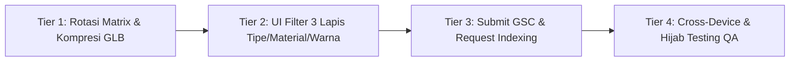

# 📋 LAPORAN MINGGUAN (WEEKLY PROGRESS REPORT)

| Informasi | Keterangan |
| :--- | :--- |
| **Proyek** | Website, Photobooth & AR Virtual Try-On 3D Optik I See You |
| **Domain** | [optikiseeyou.com](https://optikiseeyou.com) |
| **Periode Kerja** | Selasa, 25 Agustus 2026 – Sabtu, 29 Agustus 2026 |
| **Status Hari Libur** | Minggu, 30 Agustus 2026 & Senin, 31 Agustus 2026 *(Off)* |
| **Tanggal Dibuat** | Selasa, 1 September 2026 |

---

## 🏆 1. PENCAPAIAN (ACHIEVEMENTS)

### 📌 Rangkuman Pilar Utama
1. **Migrasi Storage ke Cloudflare R2 (Efisiensi & Stabilitas Tinggi):**
   * Menggantikan dependency upload Cloudinary server-side ke arsitektur Cloudflare R2 yang jauh lebih cepat, stabil, dan cost-effective untuk menyimpan foto HD dan animasi GIF.
2. **Penyempurnaan Pipeline Photobooth & GIF Generator:**
   * Optimasi engine komposit frame, watermarking, timeline rendering multi-frame GIF, dan dynamic routing untuk download foto via QR Code.
3. **Stabilisasi Sistem AR Try-On 3D Glasses:**
   * Mengembalikan stabilitas kamera orthographic untuk menjaga proporsi pixel-perfect kacamata, kalibrasi *Y-offset*, dan penambahan varian frame photobooth baru.
4. **Implementasi Halaman Cabang & Arsitektur SEO Local:**
   * Merilis landing page dinamis untuk 4 cabang utama (Purwokerto, Purbalingga, Wonosobo, Cilacap) lengkap dengan Schema.org JSON-LD (`LocalBusiness`), Google Maps embed, dan integrasi WhatsApp CS per cabang.

---

### 📅 Detail Rincian Harian

#### 🔹 Selasa, 25 Agustus 2026
* **Infrastruktur Cloudflare R2:**
  * Pembuatan klien R2 (`lib/r2Client.ts`) dan endpoint upload (`app/api/upload-photo/route.ts`).
  * Integrasi library `@aws-sdk/client-s3` dan pembuatan dokumentasi setup (`docs/CLOUDFLARE_R2_SETUP.md`).
* **Download & Dynamic Photo Page:**
  * Refactor halaman pengunduhan foto (`app/download/page.tsx`) dan route API foto (`app/api/photo/route.ts`).
* **Optimasi GIF Generator:**
  * Peningkatan performa rendering animasi GIF photobooth (`lib/gifGenerator.ts`).
* **Audit Regresi AR Camera:**
  * Investigasi isu scale & anchor kacamata 3D akibat penggunaan `PerspectiveCamera`.

#### 🔹 Rabu, 26 Agustus 2026
* **Stabilisasi AR Try-On 3D Glasses:**
  * Mengembalikan sistem kamera ke `OrthographicCamera` dan memasang kembali `Y_OFFSET_FACTOR` (0.22) pada `components/ar/Glasses3DRenderer.tsx` dan `lib/landmarks.ts`.
  * Dokumentasi teknis riwayat bug & fix di `FIX-LOG.md` dan `ROTATION-FIX-SUMMARY.md`.
* **Aset & Frame Photobooth:**
  * Penambahan 4 frame baru: `frame 4 pink.png`, `frame hijau 3.png`, `frame pink 3.png`, `frame putih 4.png`.
  * Pembaruan komponen pemilih frame (`components/ui/FrameThemePicker.tsx`) dan `lib/frameCompositor.ts`.
* **Roadmap UX Baru:**
  * Penyusunan dokumen master `plan.md` untuk perancangan UI AR Try-On 3D ala sistem Kios AI (filter Tipe, Material, Warna) khas brand I See You.

#### 🔹 Kamis, 27 Agustus 2026
* **Audit & Riset SEO Google Search Console (GSC):**
  * Analisis indexing error (pengalihan halaman, missing structured data, dan perbandingan dengan Google Business Profile / Google Maps Local Pack).
  * Perancangan taksonomi halaman cabang dan skema data JSON-LD terstruktur per kota.

#### 🔹 Jumat, 28 Agustus 2026
* **Pengembangan Halaman Cabang Lokal (`/cabang/[slug]`):**
  * Membangun halaman responsif untuk Purwokerto, Purbalingga, Wonosobo, dan Cilacap di `app/cabang/[slug]/page.tsx`.
  * Implementasi Schema Markup `Optician`/`LocalBusiness` spesifik tiap cabang (alamat, jam buka, no. telepon, koordinat geo).
* **Dokumentasi SEO Komprehensif:**
  * Merilis `1-ANALISIS-DAN-PLAN-SEO-OptikISeeYou.md` dan `2-agent-prompt-antigravity.md`.
* **Pembaruan Navigasi & Metadata:**
  * Sinkronisasi data detail cabang di `lib/branches.ts`, `components/ui/BranchCarousel.tsx`, `sitemap.ts`, dan `robots.ts`.

#### 🔹 Sabtu, 29 Agustus 2026
* **Testing & Quality Assurance (QA):**
  * Pengujian end-to-end flow photobooth: proses foto → pemilihan frame → render GIF → upload R2 → scan QR download.
  * Uji responsivitas mobile untuk seluruh halaman cabang baru.
  * Penyusunan daftar backlog dan persiapan eksekusi minggu berikutnya.

---

## ⚠️ 2. KENDALA (CHALLENGES & MITIGATIONS)

| No | Kendala yang Dihadapi | Dampak / Root Cause | Solusi & Status Mitigasi |
| :---: | :--- | :--- | :--- |
| **1** | **Regresi Skala & Posisi AR Glasses 3D** | Percobaan pergantian ke `PerspectiveCamera` merusak sistem anchor piksel dan menghilangkan offset Y, membuat kacamata mengecil dan naik ke dahi. | **[SOLVED]** Mengembalikan ke `OrthographicCamera` frustum CSS pixel dan mengunci formula `Y_OFFSET_FACTOR = 0.22`. |
| **2** | **Indexing & Redirect Error pada GSC** | Terdapat perbedaan URL kanonik (www vs non-www) dan kurangnya metadata terstruktur, sehingga beberapa URL belum terindeks penuh. | **[SOLVED]** Diterapkan standardisasi URL kanonik tunggal, penambahan structured data JSON-LD, dan pembaruan sitemap XML. |
| **3** | **Ukuran Aset 3D GLB Relatif Besar (~11MB)** | Beberapa model 3D kacamata masih menggunakan aset resolusi mentah, berisiko lambat saat diakses via data seluler. | **[IN PROGRESS]** Dijadwalkan kompresi geometri & tekstur WebP via `gltf-transform` pada sprint minggu ini (target < 1.5MB). |
| **4** | **Tracking Landmark pada Pengguna Berhijab** | Kain hijab yang menutupi telinga dapat menyebabkan gagang kacamata 3D tampak tembus atau tidak alami jika dipaksa sampai belakang kepala. | **[MITIGATED]** Diterapkan parameter `templeFadeStart` (0.6 - 0.65) agar gagang memudar secara natural sebelum batas kain hijab. |

---

## 🎯 3. PLAN & STRATEGI (1 MINGGU KE DEPAN: 1 – 5 SEPTEMBER 2026)

### 1. AR Try-On & Visual Experience
* **Implementasi Sumber Rotasi MediaPipe Asli:** Menghubungkan `facialTransformationMatrixes` yang sudah aktif di MediaPipe ke renderer 3D agar gerakan rotasi kepala semakin presisi dan minim lag.
* **UI Filter Kios AI Khas I See You:** Membangun komponen baris filter chip 3 lapis (**Tipe** / **Material** / **Warna**) dengan palet warna brand (`isy-ivory`, `isy-green-bright`, `isy-green-deep`).
* **Optimasi Aset 3D:** Mengompresi seluruh model GLB kacamata ke ukuran maksimal **≤ 1.5MB** tanpa mengubah struktur material lensa (`isLens` / `isNosePad`).

### 2. SEO & Indeksasi Google
* **Submit Ulang Sitemap di Google Search Console:** Mengajukan pembaruan `sitemap.xml` yang sudah memuat seluruh sub-halaman cabang baru.
* **Inspeksi & Request Indexing URL Cabang:** Meminta indeksasi manual satu per satu untuk `/cabang/purwokerto`, `/cabang/purbalingga`, `/cabang/wonosobo`, dan `/cabang/cilacap`.

### 3. QA & Stabilitas Mobile
* **Uji Coba Lintas Perangkat:** Testing menyeluruh di iOS Safari, Android Chrome, tablet, dan laptop.
* **Network Throttling Test:** Memastikan seluruh halaman dan fitur AR tetap dapat dibuka di bawah 3-4 detik pada koneksi 3G/4G lambat.

---

## 💡 4. MASUKAN TIM & REKOMENDASI STRATEGIS

1. **Konsistensi Google Business Profile (GBP) Antar Cabang:**
   * Segera pastikan verifikasi dan konsistensi data NAP (*Name, Address, Phone*) untuk cabang **Purbalingga** dan **Cilacap** agar seragam dengan data di website.
   * Cantumkan URL landing page masing-masing cabang (contoh: `https://optikiseeyou.com/cabang/purbalingga`) pada kolom Website di Google Business Profile.
2. **Konektivitas Akun Media Sosial:**
   * Perbarui tautan bio akun Instagram resmi (`@iseeyou.glasses`) agar mengarah langsung ke `optikiseeyou.com` (bukan linktree generik) guna memperkuat *Entity Authority* di Google Knowledge Graph.
3. **Standarisasi Aset 3D Produk Asli:**
   * Untuk pengembangan jangka panjang, disarankan membuat foto 3D scanning dari unit fisik frame kacamata *best-seller* di toko agar katalog AR Try-On 100% presisi dengan inventaris nyata.
4. **SOP Testing Pengguna Berhijab:**
   * Menjadikan skenario wajah berhijab sebagai checklist QA utama dalam setiap perilisan update fitur AR/Photobooth.
